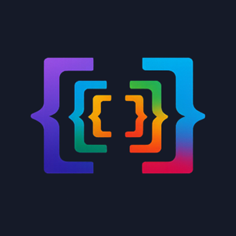
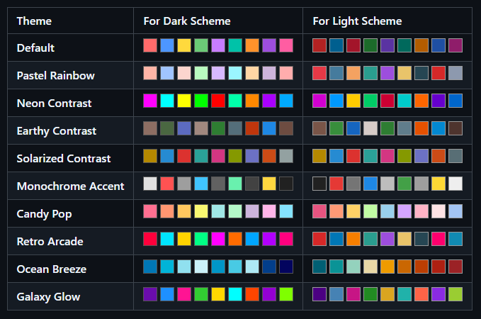

<div align="center">



</div>

# Nestica

Nestica is a Visual Studio Code extension that colors nested bracket pairs for better readability.

- Supported bracket types: `()`, `{}`, `[]`, `<>`
- Supported file types: TypeScript, JavaScript, CSS, SCSS, LESS, JSON, JSONC, Vue, HTML, JSX, TSX, C-like languages (C, C++, C#, Java, ...)
- Customizable colors and guide lines

## Screenshots

| Example with code                                        | Brackets                                     |
| -------------------------------------------------------- | -------------------------------------------- |
|  |  |

## Features

- Colors both opening and closing brackets by nesting depth
- Colorful vertical guides for nested brackets and tags
- Works in any language where these bracket characters are present
- Live updates while typing
- Customizable colors and guide line styles
- Option to choose predefined color palettes

### Languages supported by Nestica:

`typescript`, `javascript`, `css`, `scss`, `less`, `json`, `jsonc`, `xml`, `vue`, `html`, `jsx`, `tsx`, `c`,
`cpp`, `csharp`, `java`, `go`, `rust`, `php`, `swift`, `kotlin`, `dart`, `objective-c`, `objective-cpp`,
`scala`, `groovy`, `perl`, `ruby`, `shaderlab`, `glsl`, `hlsl`, `fsharp`, `vala`, `verilog`, `systemverilog`,
`actionscript`, `coffeescript`, `qml`, `cuda-cpp`, `nim`, `crystal`, `v`, `solidity`, `elm`, `d`, `plaintext`.

> [!NOTE]
> If your language is not supported, you can create an issue to include it in the next release. You can also contribute by submitting a pull request with the necessary changes to support your language to the [Nestica on GitHub](https://github.com/olton/nestica)

## Development Setup

1. Install:

    ```bash
    git clone https://github.com/olton/nestica.git
    cd nestica
    ```

2. Build extension sources:

    ```bash
    npm run build
    ```

3. Open this project in VS Code and press `F5` to start the Extension Development Host.

## Installation

You can install Nestica from the Visual Studio Code Marketplace: [Nestica](https://marketplace.visualstudio.com/items?itemName=SerhiiPimenov.nestica)

or

Open the Extensions view in VS Code, search for "Nestica", and click "Install".

## Usage

Nestica runs automatically after activation. You can also manually refresh bracket decorations with:

- `Nestica: Refresh` command from the Command Palette.

You can customize colors in your VS Code settings:

```json
{
    "nestica.brackets.enabled": true,
    "nestica.colors": ["#FF6B6B", "#FFD166", "#06D6A0", "#4CC9F0", "#4895EF", "#B5179E"],
    "nestica.guides.enabled": true,
    "nestica.guides.thickness": 1,
    "nestica.guides.opacity": 1,
    "nestica.guides.fillEmptyLines": true
}
```

> [!NOTE]
> When `nestica.guides.fillEmptyLines` is enabled, Nestica inserts indentation into empty lines inside bracket blocks so guide lines can render continuously.
> This changes the document text (visible in undo history and Git diff).

## Color Palettes

| Theme                  | Dark Colors                                                                                       | Light Colors                                                                                      |
| ---------------------- | ------------------------------------------------------------------------------------------------- | ------------------------------------------------------------------------------------------------- |
| **Default**            | `#FF6B6B`, `#4D96FF`, `#FFD93D`, `#6BCB77`, `#C77DFF`, `#00C2A8`, `#FF922B`, `#9D4EDD`, `#FF5DA2` | `#B22222`, `#005F8F`, `#A3152A`, `#1C6B2A`, `#5A33A2`, `#00695C`, `#B35C00`, `#1F4FA3`, `#8F1D6A` |
| **Pastel Rainbow**     | `#FFB5A7`, `#A0C4FF`, `#FCD5CE`, `#B9FBC0`, `#D7B9FF`, `#9BF6FF`, `#FFD6A5`, `#CDB4DB`, `#FFADAD` | `#E63946`, `#457B9D`, `#F4A261`, `#2A9D8F`, `#9D4EDD`, `#E9C46A`, `#264653`, `#D62828`, `#8D99AE` |
| **Neon Contrast**      | `#FF00FF`, `#00FFFF`, `#FFFF00`, `#00FF00`, `#FF0000`, `#00FFAA`, `#FF8800`, `#AA00FF`, `#00AAFF` | `#D100D1`, `#0099FF`, `#FFCC00`, `#00CC66`, `#CC0033`, `#00CCCC`, `#FF6600`, `#6600CC`, `#0066CC` |
| **Earthy Contrast**    | `#8D6E63`, `#4A6741`, `#5C6BC0`, `#A1887F`, `#2E7D32`, `#546E7A`, `#BF360C`, `#1E88E5`, `#6D4C41` | `#795548`, `#388E3C`, `#1565C0`, `#D7CCC8`, `#2E7D32`, `#607D8B`, `#E65100`, `#0288D1`, `#4E342E` |
| **Solarized Contrast** | `#B58900`, `#268BD2`, `#DC322F`, `#2AA198`, `#D33682`, `#859900`, `#6C71C4`, `#CB4B16`, `#93A1A1` | `#B58900`, `#268BD2`, `#DC322F`, `#2AA198`, `#D33682`, `#859900`, `#6C71C4`, `#CB4B16`, `#586E75` |
| **Monochrome Accent**  | `#E0E0E0`, `#FF5252`, `#9E9E9E`, `#40C4FF`, `#616161`, `#69F0AE`, `#424242`, `#FFD740`, `#212121` | `#212121`, `#E53935`, `#757575`, `#1E88E5`, `#BDBDBD`, `#43A047`, `#9E9E9E`, `#FDD835`, `#EEEEEE` |
| **Candy Pop**          | `#FF6F91`, `#FF9671`, `#FFC75F`, `#F9F871`, `#A0E7E5`, `#B4F8C8`, `#CDB4DB`, `#FFB5E8`, `#85E3FF` | `#E75480`, `#FF9A76`, `#FFD166`, `#C1FBA4`, `#9AD0EC`, `#D4A5FF`, `#FFB3C6`, `#FDE2E4`, `#A3C4F3` |
| **Retro Arcade**       | `#FF003C`, `#00E5FF`, `#FFD300`, `#00FF85`, `#FF00FF`, `#FF6B00`, `#00A6FF`, `#B200FF`, `#FF007F` | `#D62828`, `#0077B6`, `#F77F00`, `#2A9D8F`, `#9D4EDD`, `#E9C46A`, `#264653`, `#FF006E`, `#118AB2` |
| **Ocean Breeze**       | `#0077B6`, `#00B4D8`, `#90E0EF`, `#CAF0F8`, `#0096C7`, `#48CAE4`, `#ADE8F4`, `#023E8A`, `#03045E` | `#005F73`, `#0A9396`, `#94D2BD`, `#E9D8A6`, `#EE9B00`, `#CA6702`, `#BB3E03`, `#AE2012`, `#9B2226` |
| **Galaxy Glow**        | `#6A0DAD`, `#1E90FF`, `#FF1493`, `#32CD32`, `#FFD700`, `#00FFFF`, `#FF4500`, `#9400D3`, `#7FFF00` | `#4B0082`, `#4682B4`, `#C71585`, `#228B22`, `#DAA520`, `#20B2AA`, `#FF6347`, `#8A2BE2`, `#9ACD32` |

<div align="center">



</div>

## Contributing

Contributions are welcome. Feel free to submit a pull request or open an issue.

## Support

If you like this project, please consider supporting it by:

- Star this repository on GitHub
- Sponsor this project on GitHub Sponsors
- **PayPal** to `serhii@pimenov.com.ua`.
- [**Patreon**](https://www.patreon.com/metroui)
- [**Buy me a coffee**](https://buymeacoffee.com/pimenov)

---

Copyright (c) 2026 by [Serhii Pimenov](https://pimenov.com.ua). All Rights Reserved.
