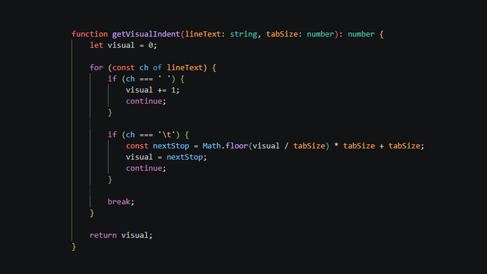
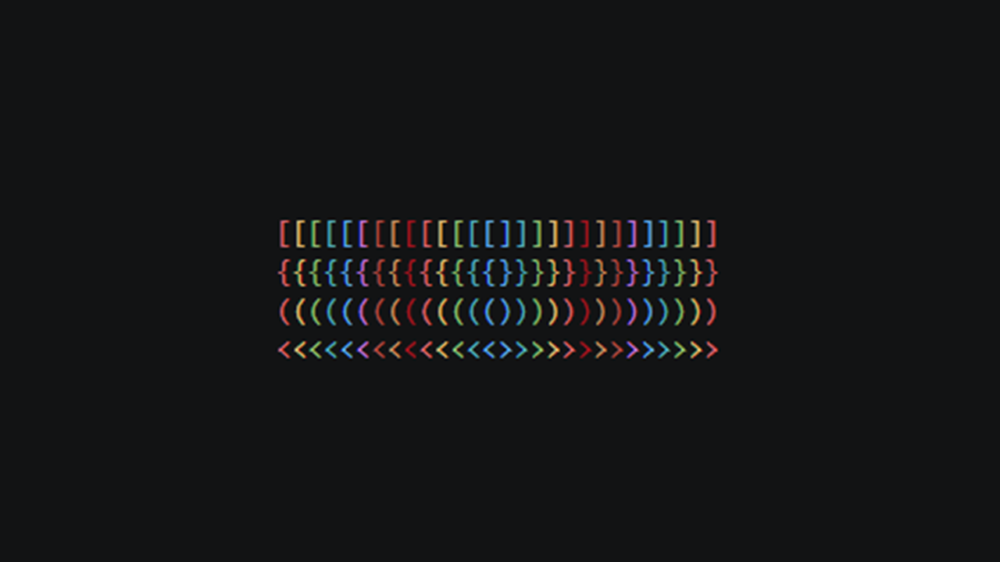

# Nestica

Nestica is a Visual Studio Code extension that colors nested bracket pairs for better readability.

- Supported bracket types: `()`, `{}`, `[]`, `<>`
- Supported file types: TypeScript, JavaScript, CSS, SCSS, LESS, JSON
- Customizable colors and guide lines

## Screenshots

| Example with code                                        | Brackets                                     |
| -------------------------------------------------------- | -------------------------------------------- |
|  |  |

## Features

- Colors both opening and closing brackets by nesting depth
- Works in any language where these bracket characters are present
- Live updates while typing

## Development Setup

1. Install:

    ```bash
    git clone https://github.com/olton/nestica.git
    cd nestica
    ```

2. Build extension sources:

    ```bash
    npm run build
    ```

3. Open this project in VS Code and press `F5` to start the Extension Development Host.

## Installation

You can install Nestica from the Visual Studio Code Marketplace: [Nestica](https://marketplace.visualstudio.com/items?itemName=SerhiiPimenov.nestica)

or

Open the Extensions view in VS Code, search for "Nestica", and click "Install".

## Usage

Nestica runs automatically after activation. You can also manually refresh bracket decorations with:

- `Nestica: Refresh` command from the Command Palette.

You can customize colors in your VS Code settings:

```json
{
    "nestica.brackets.enabled": true,
    "nestica.colors": ["#FF6B6B", "#FFD166", "#06D6A0", "#4CC9F0", "#4895EF", "#B5179E"],
    "nestica.guides.enabled": true,
    "nestica.guides.thickness": 1,
    "nestica.guides.opacity": 1,
    "nestica.guides.fillEmptyLines": true
}
```

## Contributing

Contributions are welcome. Feel free to submit a pull request or open an issue.

## Support

If you like this project, please consider supporting it by:

- Star this repository on GitHub
- Sponsor this project on GitHub Sponsors
- **PayPal** to `serhii@pimenov.com.ua`.
- [**Patreon**](https://www.patreon.com/metroui)
- [**Buy me a coffee**](https://buymeacoffee.com/pimenov)

---

Copyright (c) 2026 by [Serhii Pimenov](https://pimenov.com.ua). All Rights Reserved.
